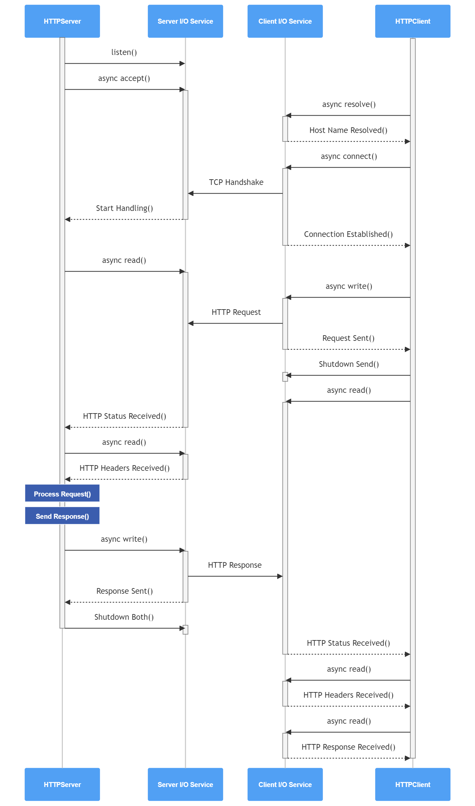

# Asynchronous HTTP Client-Server

## Contents
* [Overiew](#overview)
* [Communication Sequence](#communication-sequence)
* [HTTP](#HTTP)
* [Dependencies](#dependencies)

## Overview
This project implements asynchronous HTTP client-server communication using Boost.Asio. The HTTP client generates a request message for a specific resource on the server, transmitting it over TCP. The HTTP server, upon receiving the request, parses it, retrieves the requested resource (from a file system or database), and returns it to the client in an HTTP response. This implementation focuses on asynchronous I/O operations, leveraging the capabilities of Modern C++ functionalities like Lambda Expressions, Smart Pointers, Threads and Boost.Asio for scalable and high-performance networking.

## Communication Sequence

<br>
<p align="center">
 
<br>
</p>
<br>

## HTTP

### Client

**HTTPClient**

Acts as a factory of `HTTPRequest` objects. The `createRequest()` method creates and returns a shared pointer to a `HTTPRequest` with the given request id.

```cpp
HTTPClient http_client;
std::shared_ptr<HTTPRequest> http_request_one = http_client.createRequest(1);
```

**HTTPRequest**

An instance of the `HTTPRequest` represents a single HTTP GET request. Two send a HTTP Request to steps need to be done.
Firstly, the parameters of the request and the callback function to be called when the request completes are set by calling the corresponding setter methods on the object. 

```cpp
http_request_one->setHost("localhost");
http_request_one->setUri("/index.html");
http_request_one->setPort(3334);
http_request_one->setCallback(handler);
```

Then, the `execute()` method is invoked to initiate the request execution. When the request completes, the callback function is called.

```cpp
http_request_one->request_one->execute();
```
The `execute()` method begins the execution of a request by initiating a sequence of asynchronous operations. Each asynchronous operation performs one step of request execution procedure.

**HTTPResponse**

The `HTTPResponse` class does not provide much functionality. It is more like a plain data structure containing data members representing different parts of a response, with getter and setter methods defined, allowing getting and setting corresponding data member values.

### Server

**Server**

The `Server` class represents a server itself. It consists of two methods: `start()` and `stop()`. The `start()` method starts accepts two arguments. First argument named `port_num` specifies the number of the protocol port on which the server should listen for incoming connections. The second argument named `thread_pool_size` specifies the number of threads to add to the pool of threads running the even loop and deliver asynchronous operation completion events.

```cpp
Server srv;
srv.start(port_num, thread_pool_size);
srv.stop();
```

**Acceptor**

The `Acceptor` class is a part of the server application's infrastructure. Its constructor accepts a port number on which it will listen for the incoming connection requests as its input argument. It consists of two methods: `start()` and `stop()`. When started it puts the acceptor socket in listening mode and initiates the asynchronous accept operation, calling the `asio::async_accept()` method on the acceptor socket object and passing the object representing an active socket to it as an argument.

```cpp
auto sock = std::make_shared<asio::ip::tcp::socket>(m_ios);
m_acceptor.async_accept(*sock.get(), 
            [this, sock](const boost::system::error_code &error) {onAccept(error, sock); });
```

**Service**

The `Service` class is the key functional component in the application. While other components constitute an infrastructure of the server, this class implements the actual function provided by the server to the clients. One instance of this class is intended to handle a single connected client by reading the request, processing it, and then sending back the response message.
After an instance of the Service class has been constructed, its `start_handling()` method is called by the `Acceptor` class. From this method, the sequence of asynchronous method invocations begins, which performs request receiving, processing, and response sending. The `start_handling()` method immediately initiates an asynchronous reading operation calling the `asio::async_read_until()` function in order to receive the HTTP request line sent by the client. 

```cpp
asio::async_read_until(*m_sock.get(), m_request, "\r\n",
	  [this](const boost::system::error_code &ec, std::size_t bytes_transferred)
      {on_request_line_received(ec, bytes_transferred);});
```


## Dependencies
```sh
sudo apt-get update
sudo apt-get install libboost-all-dev
```